# Dolby Atmos Object Extraction & Binaural Processing Guide (OFFLINE - Ripped Content)

Date: January 2025

## 🎯 SCOPE: Offline Dolby Atmos Processing Only
**This guide covers**: Processing **Dolby Atmos** tracks from your personal Blu-ray rips
**This guide does NOT cover**: 
- Real-time streaming from Netflix, Disney+, Amazon Prime, etc.
- **DTS:X content** (see limitation below)

## ⚠️ **DTS:X Limitation**
**Current Status**: The Cavern project does **NOT support DTS:X object extraction**. This workflow is **Dolby Atmos only**.
**For DTS:X content**: You'll need to use the bed-only processing methods (HeSuVi/Virtuoso) covered in other guides.

## Goal
Extract full **Dolby Atmos** object metadata from your Blu-ray rips and render to personalized binaural audio using your 192kHz HRTF measurements. Process on Ubuntu Linux for maximum audio quality and automation capabilities, then transfer results for Windows HTPC playback.

## 📺 **For Streaming Services**: See Future Development
Real-time Atmos processing for streaming services requires different approaches:
- **Dolby Access integration** (generic HRTF, real-time)
- **Hardware AVR bitstreaming** (AVM70 approach)
- **Custom streaming capture methods** (advanced, legal considerations)

This offline workflow provides the **highest quality** solution but only works with Dolby Atmos content you own on disc.

---

## What you will achieve
- Extract up to 118 individual Atmos objects from TrueHD+Atmos tracks
- Render objects to 9.1.6 channel layout (15 discrete speakers) or full object-based processing
- Apply your personal 192kHz HRTF measurements for maximum spatial accuracy
- Create binaural stereo tracks that preserve all Atmos spatial information
- **🎯 KEY BENEFIT**: Final output is standard stereo - plays on ANY device with no special software required
- Integrate processed tracks back into MKV files for seamless playback on your existing HTPC

---

## Platform Choice: Ubuntu Linux for Maximum Quality

### Ubuntu Advantages (Why We Choose Linux)
- **Superior audio processing**: SoX for best-in-class sample rate conversion
- **No Windows audio stack limitations**: Direct hardware access via ALSA/JACK
- **Better automation**: Powerful scripting and batch processing capabilities
- **Audiophile tools**: CamillaDSP, advanced FFmpeg filters
- **Multi-channel handling**: Native support for >8 channels without workarounds
- **Processing efficiency**: Better memory management for large files

### Windows Alternative (For Reference)
- **Pros**: Cavern tools native, GUI convenience, integrated testing
- **Cons**: Windows audio stack limitations, fewer automation options
- **When to use**: If you prefer GUI workflow or have Windows-specific requirements

## Prerequisites

### Your Hardware Setup
- **Processing Machine**: Intel i5-12600KF (6P+4E cores, up to 4.9 GHz) ✅
- **Memory**: 64GB DDR5-5200 CL40 ✅ (Excellent for large audio file processing)
- **Storage**: 1TB M.2 SSD (Ubuntu) + 1TB M.2 SSD (Windows 11 dual boot) ✅
- **Source Storage**: QNAP NAS (RAID 5) storing MakeMKV Blu-ray/UHD rips ✅
- **Ripping Tool**: MakeMKV (already in use) ✅

### Performance Expectations
- **12600KF Optimization**: 6 P-cores excel at Cavern processing; 4 E-cores handle background tasks
- **64GB RAM**: Process multiple large films simultaneously without swapping
- **M.2 Performance**: Fast read/write for intermediate processing files
- **Expected Processing Speed**: ~2-4x real-time for TrueHD Atmos tracks

### Software (Ubuntu) - Optimized for Your Setup
- **NAS Access**: SMB/NFS mounting for direct access to QNAP-stored rips
- **mkvtoolnix**: `sudo apt install mkvtoolnix` (extract/remux)
- **Cavern Project** via Mono/.NET:
  - `sudo apt install mono-complete` or `dotnet-runtime-6.0`
  - `truehdd` and `Cavernize` (optimized for 12600KF multi-threading)
- **SoX**: `sudo apt install sox libsox-fmt-all` (best-in-class 192kHz SRC)
- **Python/NumPy/SciPy**: High-quality convolution (utilizes your 64GB RAM)
- **Optional**: **CamillaDSP**, **libear** (EBU ADM renderer)

### Workflow Integration with Your Setup
```
QNAP NAS (Ripped Files) → Ubuntu Mount → Cavern Processing → Windows Transfer → HTPC Playback
```
- **Source**: Access MakeMKV rips directly from QNAP via network mount
- **Processing**: Ubuntu machine handles heavy lifting with your 64GB RAM
- **Transfer**: Copy processed binaural tracks to Windows M.2 drive
- **Playback**: Use existing Windows HTPC setup with processed files

### Quality Requirements
- **Sample rate**: 192kHz throughout (or highest your hardware supports)
- **Bit depth**: 32-bit float for processing, 24-bit minimum for storage
- **HRTF measurements**: From `Impulcifer_Measurement_Guide.md` with height channels

---

## Visual Workflow Overview

```mermaid
flowchart TD
    A["🎬 Blu-ray Disc<br/>TrueHD+Atmos Track"] --> B["📀 MakeMKV<br/>Rips to MKV file"]
    B --> C["📁 movie.mkv<br/>(contains TrueHD+Atmos)"]
    C --> D["🔧 mkvextract<br/>(from mkvtoolnix)"]
    D --> E["📄 audio.thd<br/>(raw TrueHD+Atmos bitstream)"]
    
    E --> F["⚙️ truehdd.exe<br/>(Cavern tool)"]
    F --> G["📄 audio.damf<br/>(Dolby Atmos Metadata File)"]
    G --> H["🎯 Cavernize.exe<br/>(Cavern decoder)"]
    H --> I{"Choose Output Format"}
    
    I --> J["📊 9.1.6_audio.wav<br/>(15 channels, 192kHz/32-bit)<br/>Objects rendered to speakers"]
    I --> K["📋 audio.adm<br/>(Full object metadata)<br/>+ individual object WAVs"]
    
    J --> L["🎧 HRTF Convolution<br/>(Your 192kHz measurements)"]
    K --> M["🔬 Advanced Object Renderer<br/>(libear + custom HRTF)"]
    
    L --> N["🎵 binaural_stereo.wav<br/>(192kHz/32-bit, ready for playback)"]
    M --> N
    
    N --> O["📦 mkvmerge<br/>(mux back to video)"]
    O --> P["🎬 final_movie.mkv<br/>(Original + Binaural track)"]
```



---

## Phase 1: QNAP NAS Access and Audio Extraction (Ubuntu)

**Reality**: Your movies are already ripped with MakeMKV and stored on QNAP NAS  
**Goal**: Access existing rips and extract Atmos audio tracks for processing  

1. **Mount QNAP NAS** (one-time setup):
   ```bash
   # Create mount point
   sudo mkdir -p /mnt/qnap
   
   # Mount via SMB (adjust IP and credentials for your QNAP)
   sudo mount -t cifs //YOUR_QNAP_IP/movies /mnt/qnap -o username=YOUR_USER,password=YOUR_PASS,uid=$(id -u),gid=$(id -g)
   
   # Make mount permanent (optional)
   echo "//YOUR_QNAP_IP/movies /mnt/qnap cifs username=YOUR_USER,password=YOUR_PASS,uid=$(id -u),gid=$(id -g) 0 0" | sudo tee -a /etc/fstab
   ```

2. **Browse your existing movie collection**:
   ```bash
   # Navigate to your MakeMKV rips
   cd /mnt/qnap/movies  # adjust path to your QNAP structure
   ls -la *.mkv
   ```

### Step 2 — Extract Atmos Audio Track from QNAP Content
**Source**: Choose a movie from your QNAP collection  
**Tool**: mkvextract (part of mkvtoolnix)  
**Process**: Extract raw Atmos bitstream without re-encoding  

1. **Select a movie and identify Dolby Atmos track**:
   ```bash
   # Choose your movie file
   MOVIE="/mnt/qnap/movies/your_movie.mkv"
   
   # Identify Dolby Atmos track number
   mkvinfo "$MOVIE" | grep -i "truehd\|atmos"
   ```
   Look for:
   - "TrueHD Atmos" or "TrueHD 7.1" (Dolby Atmos)
   - Track should show "Dolby TrueHD" with Atmos extensions

2. **Extract to local M.2 storage for processing**:
   ```bash
   # Create processing directory on fast M.2 storage
   mkdir -p ~/processing
   
   # Extract Dolby Atmos track (replace '1' with correct track number)
   mkvextract tracks "$MOVIE" 1:~/processing/audio.thd
   ```

**Performance advantage**: Direct QNAP access + M.2 processing storage + 12600KF = very fast extraction

**Output**:
- `audio.thd` (Dolby Atmos - TrueHD+Atmos bitstream, 2-4GB)

---

## Phase 2: Atmos Object Decoding (Dolby Only)

### Step 3 — Extract Atmos Metadata (Ubuntu)
**Tool**: truehdd (Cavern project via Mono/.NET)  
**Input**: `audio.thd`  
**Process**: Strip TrueHD container and extract Dolby Atmos object metadata  

```bash
# Install Cavern tools (if not already done)
# Download from https://github.com/VoidXH/Cavern/releases
# Extract to /opt/cavern/

# Run with Mono (if using .exe files)
mono /opt/cavern/truehdd.exe audio.thd audio.damf

# Or if native Linux build available
./truehdd audio.thd audio.damf
```

**Output**: `audio.damf` (Dolby Atmos Metadata File - intermediate format)

### Step 4 — Decode Objects to Channels
**Tool**: Cavernize.exe (Cavern decoder)  
**Input**: `audio.damf`  
**Process**: Render Atmos objects to your chosen output format  

#### Option A: Channel-Based Output (Recommended for Your Setup)
For 9.1.6 layout (15 channels) with top middle overheads:
```bash
# Using Mono to run Cavernize
mono /opt/cavern/Cavernize.exe audio.damf --output-format wav --layout 9.1.6 --sample-rate 192000 --bit-depth 32f 9.1.6_audio.wav

# Or if native Linux build
./Cavernize audio.damf --output-format wav --layout 9.1.6 --sample-rate 192000 --bit-depth 32f 9.1.6_audio.wav
```

**Your preferred 9.1.6 channel layout**:
- L, R, C, LFE (front)
- Ls, Rs (sides)  
- Lb, Rb (rear)
- Lw, Rw (wide front) - enhances front soundstage
- TFL, TFR, TM (top front left, right, middle) - your preferred overhead setup
- TBL, TBR, TS (top rear left, right, surround) - complete overhead coverage

#### Option B: Object-Based Output (Advanced)
For full object preservation:
```bash
mono /opt/cavern/Cavernize.exe audio.damf --output-format adm --sample-rate 192000 audio.adm
```

**Outputs**:
- `audio.adm` (XML metadata file)
- Folder of individual object WAV files (potentially 50+ files)

**File sizes**:
- 9.1.6 WAV: ~18GB for 2-hour movie (15-ch, 192kHz, 32-bit)
- ADM + objects: Variable, potentially larger

---

## Phase 3: Binaural Processing

### Path A: Channel-Based Binaural Rendering

#### Step 5A — High-Quality Convolution with Python/SciPy (Ubuntu)
**Recommended approach**: Custom Python script for maximum quality control

1. **Install Python audio processing environment**:
```bash
sudo apt install python3-pip python3-venv
pip3 install numpy scipy soundfile librosa
```

2. **Create convolution script** (`atmos_convolve.py`):
```python
#!/usr/bin/env python3
import numpy as np
import soundfile as sf
from scipy.signal import convolve
import argparse

def load_hrtf_set(hrtf_dir):
    """Load 15-channel HRTF set from Impulcifer measurements"""
    hrtf_left = {}
    hrtf_right = {}
    
    # Channel mapping to HRTF files (9.1.6 layout)
    channels = ['L', 'R', 'C', 'LFE', 'Ls', 'Rs', 'Lb', 'Rb', 'Lw', 'Rw',
                'TFL', 'TFR', 'TM', 'TBL', 'TBR']
    
    for ch in channels:
        if ch != 'LFE':  # LFE passes through
            hrtf_left[ch], _ = sf.read(f"{hrtf_dir}/{ch}_left.wav")
            hrtf_right[ch], _ = sf.read(f"{hrtf_dir}/{ch}_right.wav")
    
    return hrtf_left, hrtf_right

def process_audio(input_file, hrtf_dir, output_file):
    """Convolve 15-channel audio with personal HRTFs"""
    # Load 15-channel audio (9.1.6 layout)
    audio, sr = sf.read(input_file)
    
    # Load HRTF set
    hrtf_left, hrtf_right = load_hrtf_set(hrtf_dir)
    
    # Initialize output channels
    left_ear = np.zeros(len(audio))
    right_ear = np.zeros(len(audio))
    
    # Process each channel (9.1.6 layout)
    channels = ['L', 'R', 'C', 'LFE', 'Ls', 'Rs', 'Lb', 'Rb', 'Lw', 'Rw',
                'TFL', 'TFR', 'TM', 'TBL', 'TBR']
    
    for i, ch in enumerate(channels):
        if ch == 'LFE':
            # LFE goes to both ears equally
            left_ear += audio[:, i] * 0.5
            right_ear += audio[:, i] * 0.5
        else:
            # Convolve with HRTFs (64-bit precision)
            left_ear += convolve(audio[:, i].astype(np.float64), 
                               hrtf_left[ch].astype(np.float64), 
                               mode='same')
            right_ear += convolve(audio[:, i].astype(np.float64), 
                                hrtf_right[ch].astype(np.float64), 
                                mode='same')
    
    # Apply 6dB headroom scaling
    scale = 0.5
    left_ear *= scale
    right_ear *= scale
    
    # Save binaural output
    binaural = np.column_stack([left_ear, right_ear])
    sf.write(output_file, binaural, sr, subtype='PCM_32')

if __name__ == "__main__":
    parser = argparse.ArgumentParser()
    parser.add_argument("input", help="15-channel input WAV (9.1.6 layout)")
    parser.add_argument("hrtf_dir", help="Directory with HRTF files")
    parser.add_argument("output", help="Binaural output WAV")
    args = parser.parse_args()
    
    process_audio(args.input, args.hrtf_dir, args.output)
```

3. **Run convolution**:
```bash
python3 atmos_convolve.py 9.1.6_audio.wav /path/to/hrtf/files binaural_stereo.wav
```

#### Step 5B — Render Binaural Output
1. **Configure master bus** for stereo output
2. **Sum all processed channels** to left/right master
3. **Apply headroom scaling** (~6dB reduction to prevent clipping)
4. **Render to file**:
   - Format: WAV, 192kHz, 32-bit float
   - Length: Match original duration exactly

**Output**: `binaural_stereo.wav` (2-channel, 192kHz/32-bit)

### Path B: Object-Based Binaural Rendering (Advanced)

#### Step 5C — Process with EBU ADM Renderer
**Tool**: libear + custom HRTF integration  
**Input**: `audio.adm` + object WAV files + your HRTF database  

This requires custom development or advanced audio processing software that supports:
- ADM file parsing
- Real-time object positioning
- Dynamic HRTF selection based on 3D coordinates
- Frame-accurate processing

**Note**: This path provides theoretical maximum accuracy but requires significant technical implementation.

---

## Phase 4: Integration & Quality Control

### 🎯 **CRITICAL UNDERSTANDING: Final Playback Requirements**

**The final binaural output is STANDARD STEREO** - this means:

#### ✅ **What Works for Playback (Everything!)**
- **Any media player**: Kodi, VLC, Windows Media Player, MPC-HC, even mobile apps
- **Any audio hardware**: Your existing Topping D90 + L50, onboard audio, USB DACs, anything
- **Any operating system**: Windows, Linux, macOS, Android, iOS
- **No special software**: No Virtuoso, HeSuVi, VoiceMeeter, or processing chains needed
- **No Windows limitations**: 8-channel PCM limit completely irrelevant during playback

#### 🎧 **Playback Setup (Simple)**
```
Kodi → Select "Binaural Atmos (Personal HRTF)" track → Standard stereo output → Your DAC → Headphones
```

#### 📁 **Final MKV Structure**
```
final_movie.mkv contains:
├── Video track
├── Original TrueHD+Atmos (for AVR/speakers) 
├── Standard 7.1 PCM (compatibility)
└── Binaural Atmos (Personal HRTF) ← Standard stereo with 3D audio "baked in"
```

### Step 6 — Quality Verification
Before final integration, verify binaural quality:

1. **Spectral analysis**: Compare frequency response to source
2. **Dynamic range check**: Ensure no compression introduced
3. **Spatial verification**: Test with known reference material
4. **A/B comparison**: Against original 7.1 downmix via your normal chain
5. **👂 Critical test**: Play on standard stereo setup - should sound fully 3D with headphones

**Quality abort criteria**: If processed audio shows any degradation vs. direct stereo feed to your Hype 4 IEMs, stop and investigate bottlenecks.

### Step 7 — Mux Back to Video
**Tool**: mkvmerge  
**Inputs**: Original `movie.mkv` + `binaural_stereo.wav`  

```bash
mkvmerge -o final_movie.mkv movie.mkv --language 0:eng --track-name "0:Atmos Binaural (Personal HRTF 192kHz)" binaural_stereo.wav
```

**Output**: `final_movie.mkv` with multiple audio track options:
- Original TrueHD+Atmos (for AVR/speakers)
- Standard 7.1 PCM (compatibility)
- **Your custom binaural track** (standard stereo - works everywhere!)

### 🎉 **Final Result: True Plug-and-Play Atmos (For Your Ripped Content)**
Your processed movie now plays full 3D Atmos audio through **any stereo system**:
- **No special hardware**: Works with any DAC/headphone setup
- **No special software**: Standard media player audio settings
- **No configuration**: Just select the binaural track and play
- **Perfect portability**: Same file works on laptop, phone, any device
- **Future-proof**: Will work forever, no dependency on specific software/drivers

**⚠️ Limitation**: This workflow only applies to **your personal Blu-ray rips**. For streaming services (Netflix, Disney+, etc.), you'll need different real-time processing solutions.

---

## Quality Considerations & Bottlenecks

### Sample Rate Preservation
- **Target**: 192kHz throughout entire chain
- **Bottlenecks to check**:
  - Cavern tools: Verify 192kHz support
  - Convolution engine: Ensure no internal downsampling
  - Final playback chain: Kodi → DAC at 192kHz

### Bit Depth Management
- **Processing**: 32-bit float or 64-bit double precision
- **Storage**: 24-bit minimum, 32-bit float preferred
- **Final dithering**: Only at absolute final step if reducing bit depth

### Dynamic Range Protection
- **Scaling strategy**: Reduce input by ~6dB before convolution rather than limit output
- **Verification**: Check peak levels and dynamic range at each stage
- **Abort condition**: Any measurable degradation in clarity or dynamics

---

## Storage & Performance Requirements

### Disk Space (per 2-hour movie)
- **Source extraction**: 20-50GB (temporary)
- **Intermediate processing**: 18GB (9.1.6 WAV)
- **Final binaural**: 2.3GB (192kHz WAV) or 500MB (FLAC)

### Your Hardware Performance (i5-12600KF + 64GB DDR5)
- **TrueHD extraction**: 2-5 minutes (M.2 SSD advantage)
- **Object decoding**: 8-20 minutes (6 P-cores optimized)
- **HRTF convolution**: 15-40 minutes (64GB RAM enables large buffers)
- **Total**: 30-75 minutes per movie ✅

### Batch Processing Capability
- **Simultaneous movies**: 3-4 (with 64GB RAM)
- **Storage workflow**: QNAP → Ubuntu M.2 → Processing → Windows M.2
- **Network transfer**: QNAP access via SMB/NFS mount
- **Performance advantage**: Your setup exceeds recommended specifications

---

## Troubleshooting

### Common Issues
- **Cavern tools not found**: Ensure latest Cavern release and proper installation
- **Sample rate mismatches**: Verify all tools support 192kHz
- **Memory errors**: Reduce buffer sizes or process in chunks
- **Channel mapping wrong**: Verify HRTF assignment matches physical measurement layout

### Quality Degradation Signs
- **Frequency response changes**: Compare spectrum analyzer results
- **Dynamic compression**: Check peak/RMS ratios
- **Spatial collapse**: Verify height channels aren't mapping to bed
- **Artifacts**: Listen for aliasing, clipping, or processing noise

### Performance Optimization
- **Parallel processing**: Use multi-core convolution when available
- **Chunked processing**: Break large files into segments
- **SSD storage**: Use fast storage for intermediate files
- **Close other applications**: Maximize available CPU/memory

---

## Validation Checklist
- [ ] Source TrueHD+Atmos extracted bit-perfect
- [ ] Object metadata successfully decoded by Cavern
- [ ] 15-channel 9.1.6 WAV output verified (or ADM for object-based)
- [ ] HRTF convolution completed without errors
- [ ] Binaural output maintains 192kHz/24-bit+ quality
- [ ] Spatial imaging clearly superior to 7.1 bed downmix
- [ ] No degradation vs. direct stereo reference
- [ ] Final MKV plays correctly with multiple audio track options

---

## Legal & Technical Notes
- **Cavern Project**: MIT license, reverse-engineered implementation
- **Personal use**: Generally acceptable for owned content
- **Patent considerations**: Dolby Atmos patents still active; use at own discretion
- **Quality priority**: Abort process if any step degrades audio quality below direct stereo feed

---

## Next Steps
- Start with short test clips to validate entire workflow
- Compare results with Dolby Access output for reference
- Consider automation scripting once workflow is proven
- Evaluate upgrading to object-based rendering for ultimate accuracy

---

*This workflow represents the current state-of-the-art for DIY Atmos object extraction. As tools mature, some steps may become more automated or efficient.*
